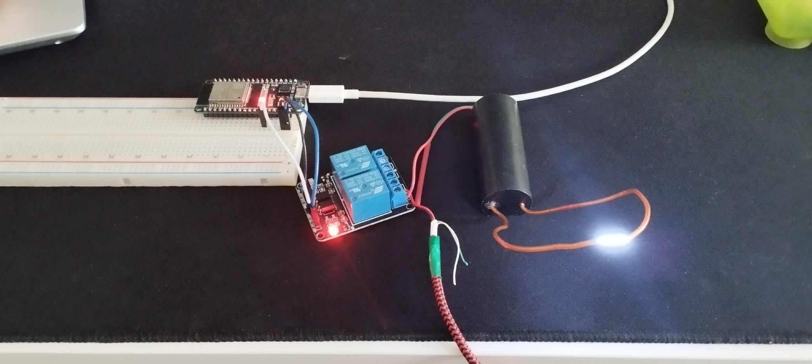

# Anti-BRAINROT
YOLO recognizing using your phone and sends a signal to ESP32 to shock you, literally

This project is made for peope, who can't put down their phones and constantly brainroting.
The YOLO python library detects the phone and sending a signal thru serial or by getting a request from the ESP32 webserver to activate the relay which turns on the high voltage generator.
<h2>!!!WARNING!!! DO NOT TOUCH THE OUTPUT OF THE HIGH VOLTAGE GENERATOR IT CAN BE DEADLY!!!</h2>

<h2>The detected frame:</h2>

<h2>The curcuit in action:</h2>
